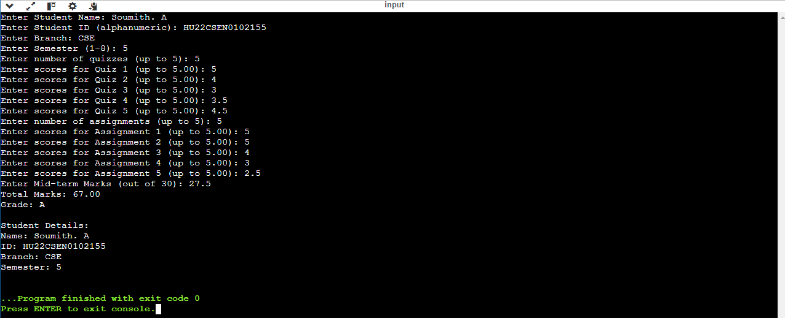
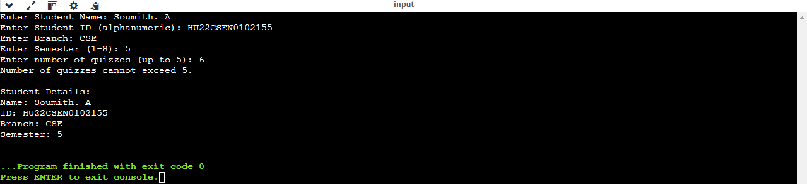
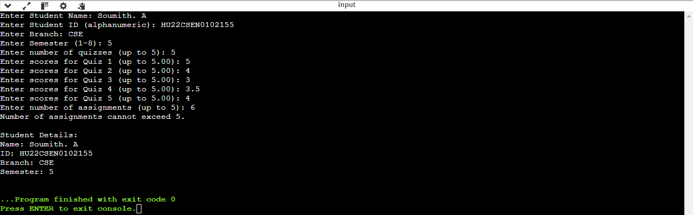
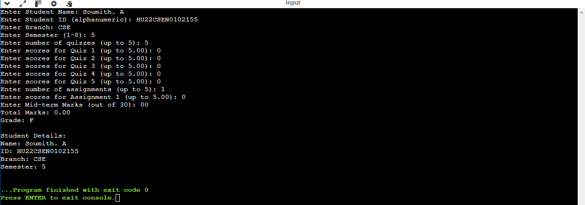
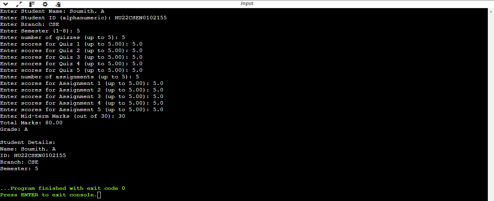
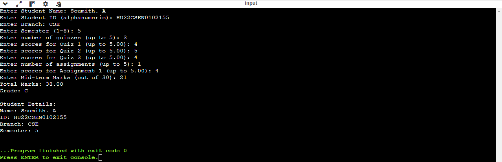
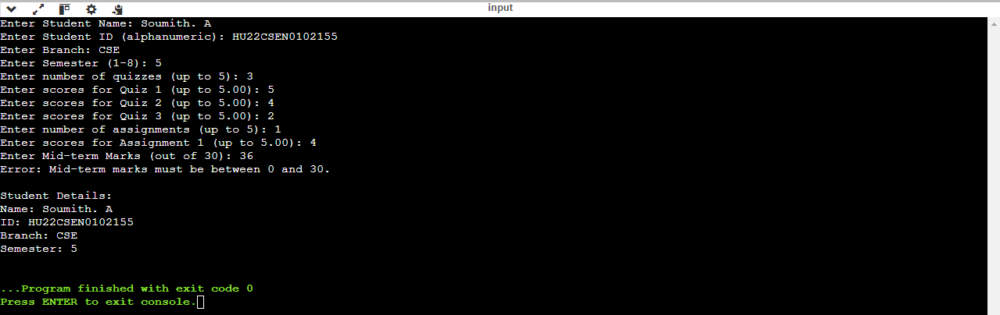

# Grade Book Application

## Problem Statement
Managing student grades across various subjects can be cumbersome for both students and educators. An efficient system is needed to input, calculate, and display grades for quizzes, assignments, and mid-term exams.

## Proposed Solution
Create a console application that allows users to:
- Input student details (name, ID, branch, semester).
- Ask for the number of subjects, quizzes, and assignments (limited to 5 each).
- Collect scores for quizzes, assignments, and mid-term marks.
- Calculate total scores and assign grades based on predefined criteria.

## Code Structure
- `main.c`: Contains the main logic of the application.
- Functions:
  - `inputStudentDetails()`: To input student information.
  - `calculateGrade()`: To calculate the total score and determine the grade.
  - `displayResult()`: To display the final results.

## How to Run
1. Compile the code using a C compiler (e.g., `gcc main.c -o GradeBook`).
2. Run the application (`./GradeBook`).

## Test Case Screenshots

1. **Test Case 1: Valid Inputs**
   

2. **Test Case 2: Quiz Limit Exceeded**
   

3. **Test Case 3: Assignment Limit Exceeded**
   
   
4. **Test Case 4: All Zero Inputs**
   

5. **Test Case 5: Perfect Score Input**
   

6. **Test Case 6: Edge Grade Calculation**
   

7. **Test Case 7: Mid Marks Limit Exceeded**
   

## Conclusion
This Grade Book application effectively simplifies the process of managing student grades by allowing easy input and calculation of scores across multiple assessments. It provides instant feedback on student performance, helping educators and students alike to monitor academic progress.
